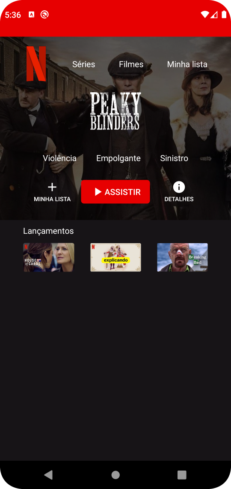

# Aplicativo da Interface da Netflix

Aplicativo desenvolvido no Android Studio fazendo uma pequena parte da interface da Netflix, feito durante o curso de [Desenvolvimento Android Completo 2023 - Kotlin & Java](https://www.udemy.com/course/desenvolvimento-android-completo/).

## Screenshot

## Licençe

Para acessar o arquivo de licença [clique aqui](./license).
